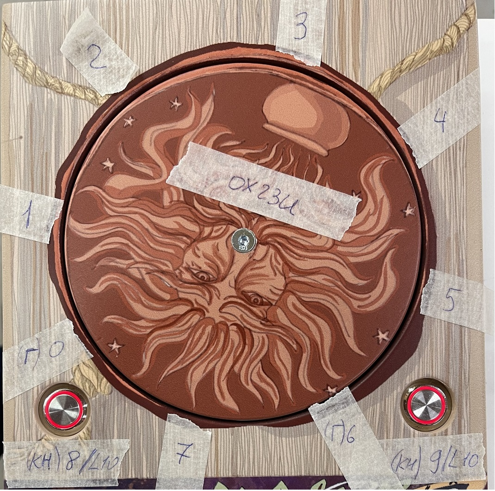
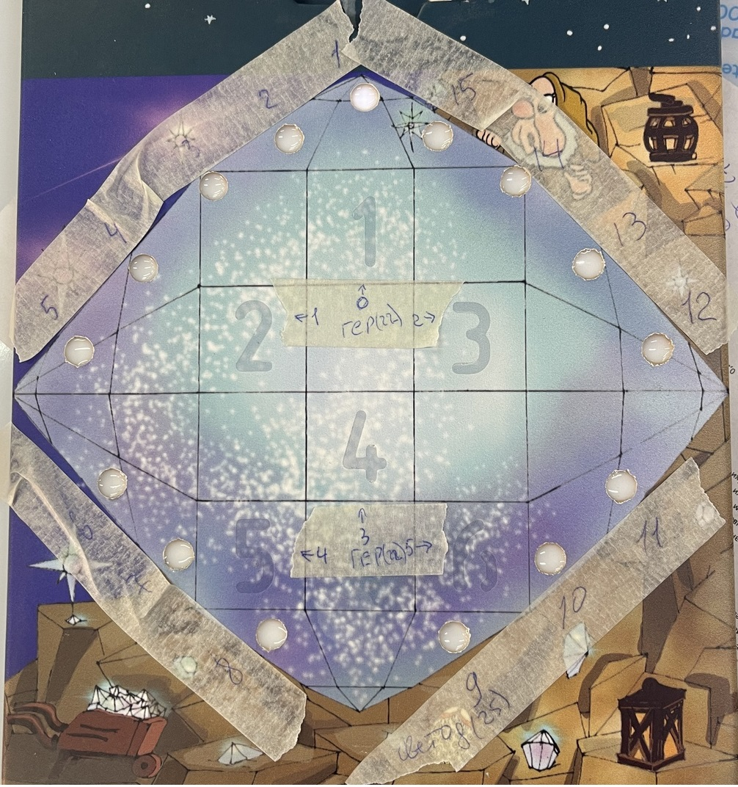
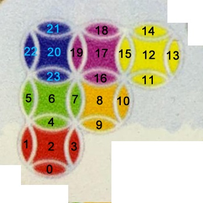

> MiniFairytales_EK1
1. Stamp
2. Merlin
3. Rainbow
4. Color rings
5. Digits
6. Coil
7. Codes
8. Hints
9. Mc

# штамп / stamp:

- №: 10 (Все загадки на одной плате)
- IP: 192.168.10.51
- Устройства: 8 герконов(расширитель x23: 0-7)
- Активация: start - не считывать герконы -> Пауза 5 сек - звук 1КМ -> Пауза N сек(учитывать язык- 2 языка) - считываем герконы.

- Прохождение: Учитываем смену языка.
Сработка геркона (1-8) - звук (2-9)КМ. Игроки должны вращать печать до определенного звука:
1) Вращается по часовой стрелке до «Щебетания птиц» - геркон 5.
2) Вращается против часовой стрелки до «Колокольчиков» - геркон 1.
3) Вращается против часовой стрелки до «Раскат грома» - геркон 6.
4) Вращается по часовой стрелке до «Тиканья часов» - геркон 3.
Любая ошибка, провращали дальше нужного геркона или не в том направлении - звук 10КМ(подсказка) + не считывать герконы -> Пауза N сек(учитывать язык- 2 языка) - считываем герконы, заново вводим комбинацию.
- Финиш: верно ввели комбинацию - пауза 3 сек - звук 11КМ -> Пауза N сек(учитывать язык- 2 языка) - activate на merlin.
> stapm end 
---
# мерлин / merlin:
- №: 20 (Все загадки на одной плате)
- IP: 192.168.10.51
- Устройства: cpz(26)
- Активация: stamp.

- Прохождение: Учитываем смену языка.

- Финиш: приложили метку - звук 12КМ -> Пауза N сек(учитывать язык- 2 языка) - activate на rainbow.

> merlin end
---
# радуга / rainbow:

- №: 30 (Все загадки на одной плате)
- IP: 192.168.10.51
- Устройства: Используются в других загадках: 6 герконов(расширитель x22: 0-5), адрес(24).
- Загрузка: выкл адрес.

- Активация: merlin.

- Прохождение: Эти герконы и адрес будут использоваться и в другой загадке. Учитываем сложность. Учитываем смену языка.
Есть 6 цифр. Индексы светодиодов(адрес): цифра 1 -> 0-1; 2 -> 2-5; 3 -> 6-9; 4 -> 10-12; 5 -> 13-16; 6 -> 17-19. Каждая цифра при прикосновении палочкой(сработка геркона) загорается своим цветом. 1 – голубым; 2 – оранжевым; 3 –зелёным, 4 – желтым; 5 – красным; 6 – синим. Касание палочкой - звук 13КМ + зажечь соответствующую цифру её цветом. Коснулись 6ти цифр подряд - проверка на верность последовательности. Неверная последовательность - пауза 1 сек -> звук 14КМ + все цифры моргают белым 3 раза и гаснут -> всё с начала. 5 раз ввели неверную последовательность(один раз, только после первых пяти ошибок) -  пауза 1 сек -> звук 14КМ + все цифры моргают белым 3 раза и гаснут -> пауза 2 сек - звук 15КМ(подсказка) + не считывать герконы -> пауза N сек(учитывать язык- 2 языка) - считываем герконы.

- Финиш: ввели верную последовательность (5, 2, 4, 3, 1, 6) - пауза 1 сек - звук (16КМ - легкий уровень или 17КМ - тяжелый уровень). Пауза N сек(разный таймер для 16 и 17 звука)(учитывать язык- 2 языка)(итого 4 таймера) - activate на color_rings + activate на digits + activate на coil + activate на codes + activate на hints.
> rainbow end
---
# цветные кольца / color_rings:

- №: 40 (Все на одной плате)
- IP: 192.168.10.51
- Устройства: 2 кнопки(расширитель x23: 8,9), лед кнопок транзистор(расширитель x23: 10), адрес(25)
- Загрузка: выкл адрес + выкл лед кнопок.

- Активация: rainbow - вкл лед кнопок + вкл адрес(комбинация2), на адресе 20ый светодиод мигает. 

- Прохождение:
Комбинация1(от 0 до 23 индекса): 14-желтый, 18-фиолетовый, 21-синий, 22-синий, 20-синий, 19-фиолетовый, 17-фиолетовый, 15-желтый, 12-желтый, 13-желтый, 11-желтый, 16-фиолетовый, 23-синий, 5-зеленый, 6-зеленый, 7-зеленый, 8-оранжевый, 10-оранжевый, 9-оранжевый, 4-зеленый, 1-красный, 2-красный, 3-красный, 0-красный.
Комбинация2(от 0 до 23 индекса):  14-красный, 18-оранжевый, 21-оранжевый, 22-зеленый, 20-синий, 19-красный, 17-фиолетовый, 15-зеленый, 12-желтый, 13-синий, 11-зеленый, 16-синий, 23-желтый, 5-красный, 6-зеленый, 7-желтый, 8-оранжевый, 10-фиолетовый, 9-синий, 4-фиолетовый, 1-желтый, 2-крансый, 3-желтый, 0-фиолетовый.
Есть адрес. В нём часть светодиодов(центральный в каждом кольце - 20,17,12,6,8,2) всегда горят своим цветом, но всегда мигает один из них - указывает какое кольцо выбрано. Остальные светодиоды могут перемещаться(ниже распишу как). 2 кнопки. Нажатие первой кнопки - звук 18КМ + смена кольца(перестаёт мигать центральный светодиод текущего кольца + начинает мигать центральный светодиод следующего кольца). Нажатие второй кнопки - звук 19КМ + происходит перемещение светодиодов по часовой стрелке на выбранном кольце.
Как меняются цвета светодиодов(индексы) при одном нажатии на вторую кнопку:
1кольцо: 21->19, 19->23, 23->22, 22->21;
2кольцо: 18->15, 15->16, 16->19, 19->18;
3кольцо: 14->13, 13->11, 11->15, 15->14;
4кольцо: 23->7, 7->4, 4->5, 5->23;
5кольцо: 16->10, 10->9, 9->7, 7->16;
6кольцо: 4->3, 3->0, 0->1, 1->4.
Комбинация1 является финишной.

- Финиш: выставили комбинацию1 на адресе - пауза 1 сек - звук 20КМ + выкл адрес. Пауза 2 сек - последовательно будут загораться зеленым по несколько центральных светодиодов(1,3,4,5,6,2 - кол-во сколько загорается за один раз). Пауза между загораниями - 1 сек. Горят - 1.5сек. После показа - пауза 2 сек - все центральные светодиоды мигают 3 раза белым и гаснут. Пауза 1 сек - показать заново.

- Обработчик: "stop_hint" - выкл адрес.
> color_rings end
---
# цифры / digits:
- №: не показывать (все на одной плате)
- IP: 192.168.10.51
- Устройства: адрес(23)
- Загрузка: выкл адрес.

- Активация: rainbow - последовательно будут загораться желтым три числа(адрес). Пауза между загораниями - 1 сек. Горят - 1.5сек. После показа - пауза 5 сек - показ заново.

- Прохождение: Всего 31 светодиод. Индексы светодиодов(адрес), которые должны гореть на каждое число: (1-вкл, 0-выкл)
1число - 1,1,1,1,1,1,0,1,0,1,1,0,1,0,1,1,0,1,1,1,1,0,1,1,0,1,1,1,1,1,1
2число - 1,1,1,1,1,1,1,1,0,0,1,0,1,0,1,1,1,0,1,1,1,1,0,0,1,1,1,1,1,1,0
3число - 1,1,1,1,1,1,0,1,1,0,0,1,0,1,1,1,0,0,1,1,1,0,1,0,1,1,1,1,1,1,0 
1 - 0,1,2,3,4,5,7,9,10,12,14,15,17,18,19,20,22,23,25,26,27,28,29,30.
2 - 0,1,2,3,4,5,6,7,10,12,14,15,16,18,19,20,21,24,25,26,27,28,29.
3 - 0,1,2,3,4,5,7,8,11,13,14,15,18,19,20,22,24,25,26,27,28,29.

- Финиш: выкл адрес.
> digits end
---
# катушка / coil:
- №: не показывать (все на одной плате)
- IP: 192.168.10.51
- Устройства: транзистор индукционка()
- Загрузка: выкл адрес + выкл индукционку.

- Активация: rainbow - вкл индукционку.

- Финиш: выкл индукционку.
> coil end
---
# коды / codes:
- №: 50 (все на одной плате)
- IP: 192.168.10.51
- Устройства: Используются в других загадках: 6 герконов(расширитель x22: 0-5), адрес(24). Используются только в этой загадке: 15 светодиодов(расширитель x25: 0-15)
- Загрузка: выкл светодиоды.

- Активация: rainbow.

- Прохождение: Для легкого уровня нужно ввести 12 кодов, для тяжелого - 15. Всего 17 загадок и соответственно 17 кодов: 
1) 432615 - загадка шестеренка
2) 536412 - загадка рисунок стрелок-цифр
3) 514632 - загадка светодиоды+катушка (электронная)
4) 451263 - загадка метро со вставляемыми элементами
5) 312465 - загадка амбиграмма
6) 352146 - загадка ткань
7) 164532 - загадка прохождение шариком
8) 461235 - загадка разбитая вентиляция
9) 254136 - загадка два лабиринта
10) 134562 - загадка светящиеся кольца (электронная)
11) 523614 - загадка пятнашки
12) 154623 - загадка календарь с цифрами
13) 215436 - загадка 7 кругов
14) 652314 - загадка лабиринт с биссером
15) 634215 - загадка загорающиеся цифры в лабиринте (электронная)
16) 561324 - загадка поиск кроликов
17) 145236 - загадка поиск пасхальных яиц
- Касание цифры - звук 21КМ + соответствующая цифра загорается белым. Ввели 6 цифр - проверка на правильность последовательности. Неверный код - пауза 1 сек -> звук 22КМ + все цифры мигают 3 раза красным и гаснут. Ввели верный код - пауза 1 сек -> звук 23КМ + адрес мигает зеленым 3 раза и гаснет + вкл следующий светодиод + "/er/hints/cmd", "номер загадки от 1 до 17". Если ввели 3,10 или 15 коды, то дополнительно: (3) - "/er/coil/cmd", "finish"; (10) - "/er/color_rings/cmd", "stop_hint";  (15) - "/er/digits/cmd", "finish".
У 16 и 17 кодов есть особенность. У каждого из них есть по 6 неверных кодов, ввод которых приведет к "аннулированию" соответствующего верного кода(больше его нельзя будет ввести - у игроков всего одна попытка на ввод). Если сначала ввели верный код, то засчитываем его как верный и все "аннулирующие" коды для этой загадки далее будут просто как обычный ввод неверного кода. Для загадки 16 такой список "особых" кодов: 651324, 563124, 561342, 651342, 653124, 653142. Ввод первого любого из этих кодов до ввода верного(561324) - пауза 1 сек -> звук 22КМ + все цифры мигают 3 раза красным и гаснут -> пауза 2 сек - звук 50КМ + больше не учитывать правильный код(561324), при его вводе будет просто ошибка, при дальнейшем вводе "аннулирующих" кодов - ошибка. Для загадки 17: 415236, 142536, 145263, 412536, 415263, 412563. Ввод первого любого из этих кодов до ввода верного(145236) - пауза 1 сек -> звук 22КМ + все цифры мигают 3 раза красным и гаснут -> пауза 2 сек - звук 51КМ + больше не учитывать правильный код(145236), при его вводе будет просто ошибка, при дальнейшем вводе "аннулирующих" кодов - ошибка. 

- Финиш: Ввели все коды(нужное кол-во для выбранного уровня сложности) - звук 24КМ + мигают последовательно цифры: 5,2,6,3. Цвет мигания - белый. Пауза между загораниями - 1 сек. Горят - 1.5сек. После показа - пауза 5 сек - показ заново.

- Обработчик: обработать смену сложности
> codes end
---
# подсказки / hints:

- №: не показывать (все на одной плате)
- IP: 192.168.10.51
- Устройства: 6 светодиодов тарнзисторы(расширитель x21: 2-7), 6 герконов подсказки(расширитель x20: 2-7)
- Загрузка: выкл светодиоды.

- Активация: rainbow. Легкий - вкл 2 подсказки(2 светодиода). Тяжелый  - 0 подсказок изначально.

- Прохождение: Надо обсудить). учитываем сложность. Соотношение индексов геркон - светодиод: 2-2, 3-3, 4-5, 5-7, 6-6, 7-4.
Подсказки даются точно по списку(смотри загадку коды). Прошли загадку(см. обработчик) - она "удаляется" из списка и больше на неё подсказка не дается + гаснет светодиод, если он горел с подсказкой к этой загадке + загорается следующий светодиод и соответственно "активируется" подсказка к следующей по списку загадке.  
На легком уровне сразу есть подсказки к загадкам 1 и 2. На тяжелом - как только проходим любую загадку - активируется первый светодиод и соответствующая подсказка(по списку). 
Касаемся активного светодиода - звук (25-41)КМ(звук соотносится с номером загадки) + не считываем герконы. Пауза Nсек(учитываем язык - 2 языка) - считываем активные герконы. Можно слушать сколько угодно раз.

- Обработчик: - Обработчик: обработать смену сложности.
"/er/hints/cmd", "номер загадки от 1 до 17" - значит прошли соответствующую загадку(нужно для системы подсказок).
> hints end
---
# mc:
- IP: 192.168.10.51
- Устройства: Mp3 Фон(Uart1), Mp3 звуки(Uart2)
> mc end

